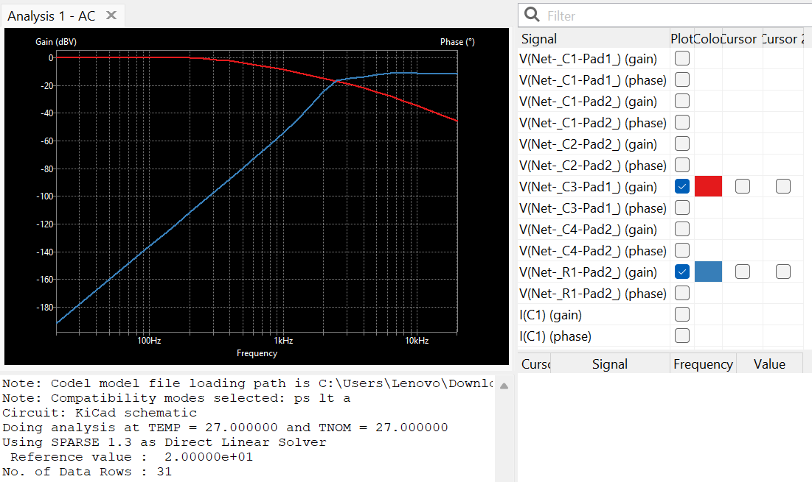

# Crossover simulation
We will be simulating an [audio crossover circuit](https://sites.google.com/site/undefinition/bookshelf-speakers/classix-ii) using the spice plugin in [KiCad 8.0.3](https://downloads.kicad.org/kicad/windows/explore/stable/download/kicad-8.0.3-x86_64.exe). This specific version is used to maintain compatibility with files since older versions of KiCad often have trouble opening designs made with newer versions. It is a large download but building familiarity with this specific frontend for spice opens up future design potential. Suggested reading "Sound Reproduction: The Acoustics and Psychoacoustics of Loudspeakers and Rooms" by Floyd E. Toole.

## Work by others
https://www.audiosciencereview.com/forum/index.php?threads/classix-ii-measurements-review.31925/   
https://forums.audioholics.com/forums/threads/classix-2-build.106779/   
[Design with the same woofer by the manufacturer with one of their tweeters](https://www.daytonaudio.com/images/resources/300-640-dayton-audio-br-1-manual-43169.pdf)   

## Approach
https://www.kicad.org/discover/spice/

## Work in progress
1. Launch KiCad:   
2. Start with default settings.
3. Opt out of updates/new versions.
4. Start with the below files:
-   [PCB File](/media/Crossover2025-12-29.kicad_pcb)   
-   [Project File](/media/Crossover2025-12-29.kicad_pro)
-   [Schematic File](/media/Crossover2025-12-29.kicad_sch)
4. Download the above /media/Crossover2025-12-29.kicad_pro, pcb, and sch into a folder named Crossover2025-12-19.
5. Use KiCad to open the _pro project file, then navigate to opening the SCH file.
6. Select Inspect->Simluator
7. Select Simulation->New Analysis Tab...
8. Analysis type: AC -- Small-Signal Analysis    
   Number of points per decade: 10
   Start frequency: 20 Hz   
   Stop frequency: 20k Hz   
9. OK
10. Simulation->Run Simulation
11. Check Plot V(Net-\_C3-Pad1\_)(gain) [x] 
12. Check Plot V(Net-\_R1-Pad2\_)(gain) [x]   
       
